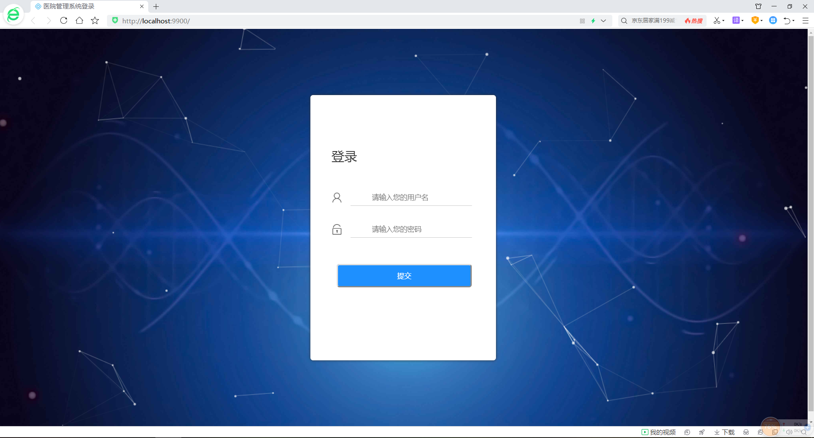
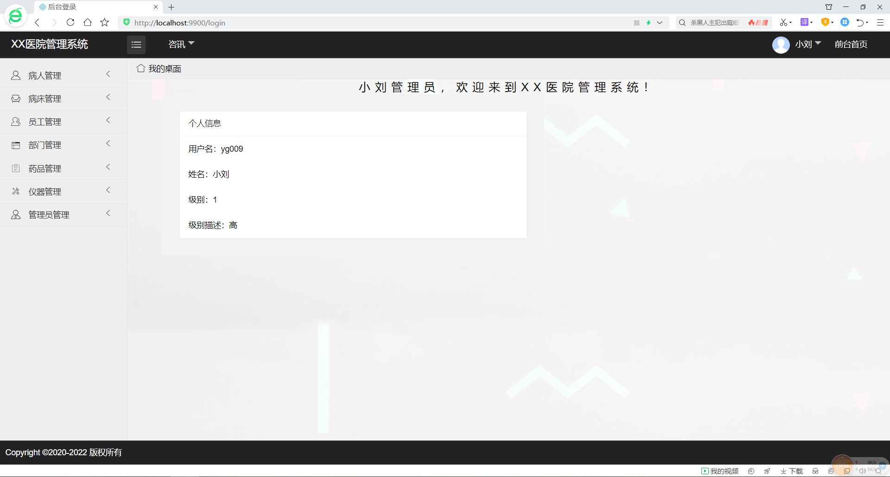
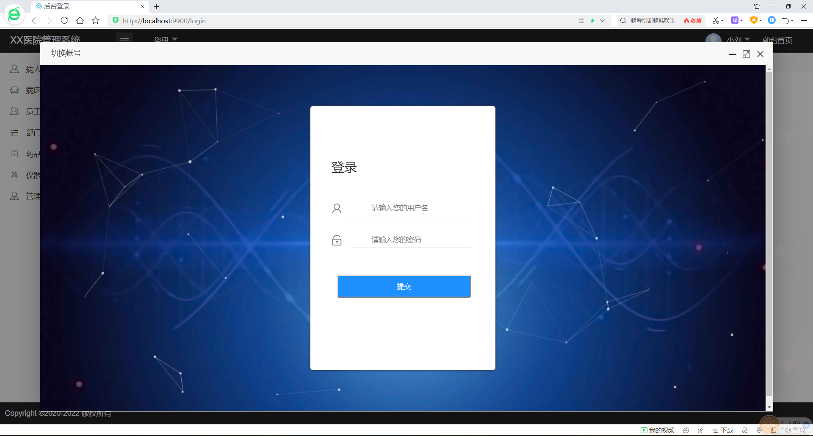
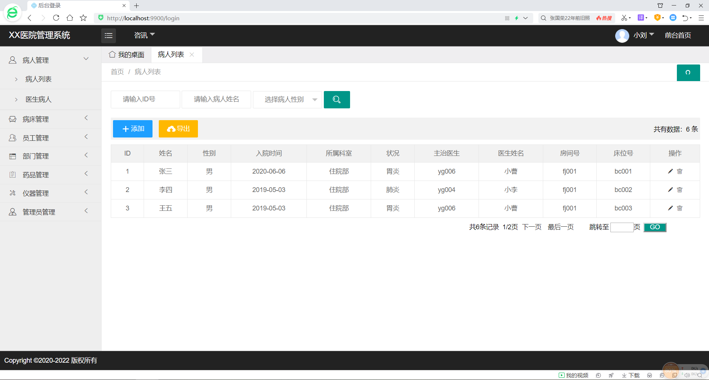
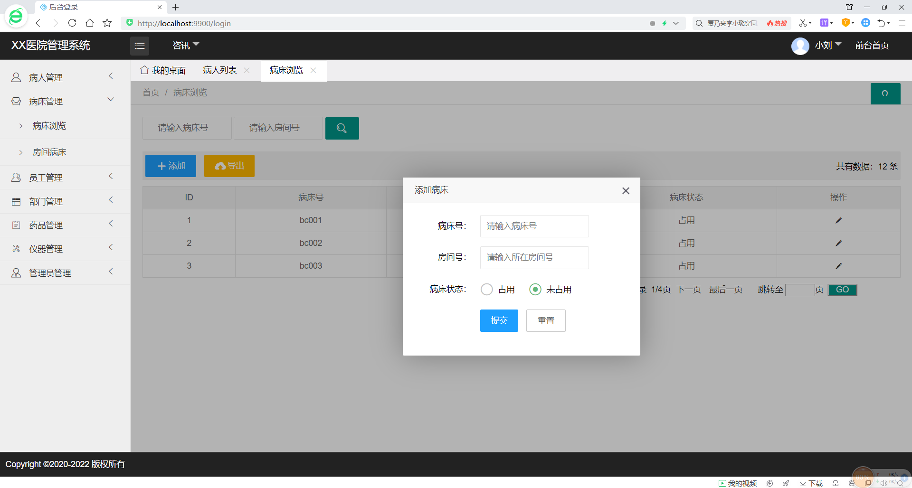
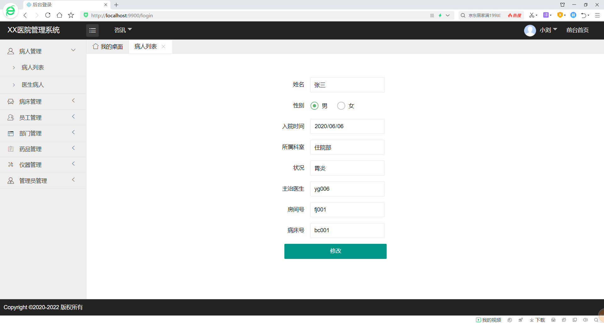
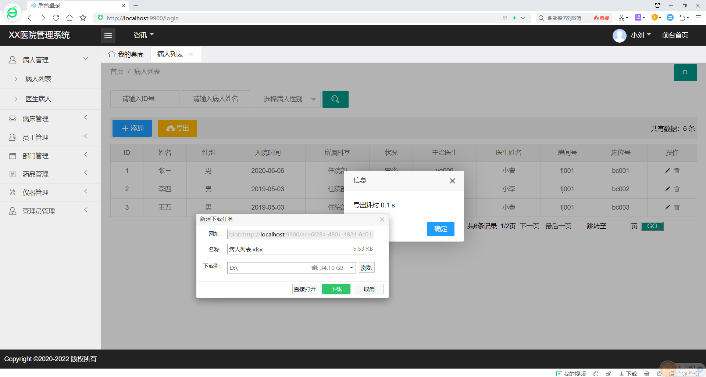
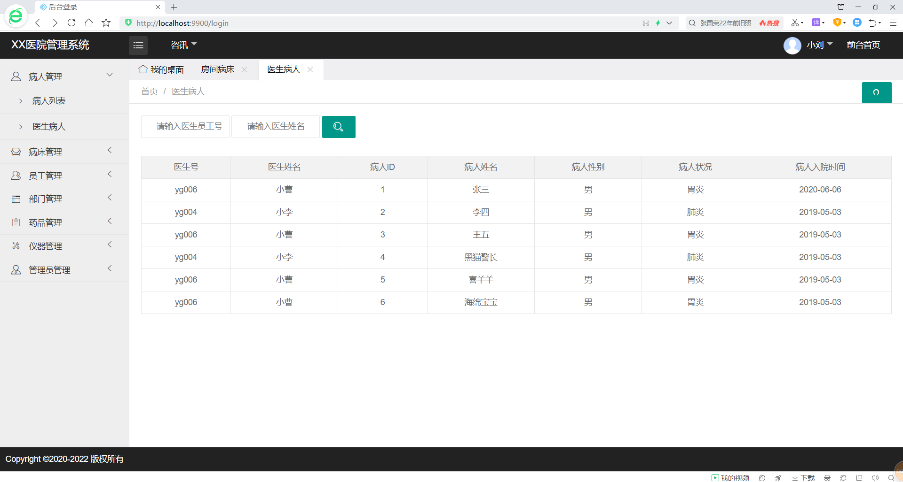
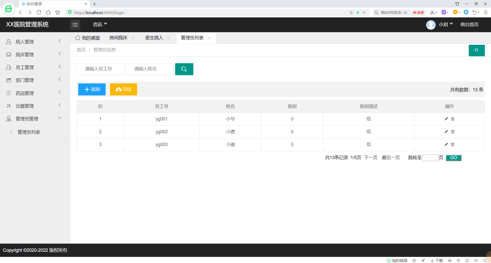

##  医院管理系统

#### 介绍
基于ssm+layui框架的小型医院后台管理系统。简单实现了病人管理、病床管理、员工管理、部门管理、药品管理、仪器管理等基础功能。
整个项目通过maven方式搭建用到的jar包通过maven导入，前端使用搭建好的Layui框架，拿来即用。后端使用SSM+MySQL，后台逻辑实现了分页、
级联、多表查询。目前项目基本完成，可重构与扩展

   
- SSM框架
- Layui框架
- MySQL数据库
- Maven搭建
- MD5加密

#### 实现功能
- [x] 管理员的登录、退出与切换  
- [x] 管理员、仪器、药品、部门、员工、病床、病人各模块增删改查  
- [x] 个别模块关联查询  
- [x] 各个模块数据导出Excel

演示地址-->[http://a.maximxie.top/](http://a.maximxie.top/)

管理员账号：yg009

密码：1234

##### 登录界面

##### 主界面

##### 切换账号

##### 病人列表

##### 添加

##### 修改

##### 导出excel表

##### 医生病人

##### 管理员列表
